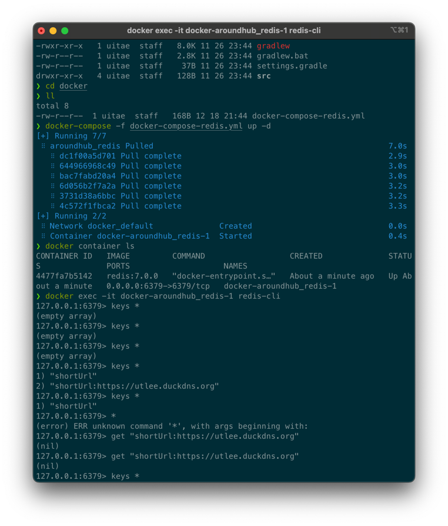

# JPA-basic1
스프링부트 기초에 대해 스터디
- JPA
- Junit
- RestTemplate

TDD란? : 테스트 주도 개발
- Junit5는 Jupiter, platform, vintage로 구성됨
- Jupiter는 구현체
platform 은 인터페이스
vintage는 juit 3,4 실행

@SpringBootTest
- 통합 테스트용도로 사용됨
- @SpringBootApplication을 찾아가 하위의 모든 Bean을 스캔
- Test용 Application Context를 만들어서 Bean을 추가하고 MockBean을 찾아서 교체

@ExtendWith
- Junit4에서 @RunWith로 사용되던게 => @ExtendWith로 변경됨
- @ExtendWith는 메인으로 실행 될 class를 지정할 수 있음
- @SpringBootTest는 기본적으로 @ExtendWith가 추가되어있음

@WebMvcTest(class명)
- ()에 작성된 클래스만 실제로 로드해서 테스트 진행
- 매개변수를 지정해주지 않으면 @Controller, @RestController, @RestControllerAdvice 등 컨트롤러와 연관된 Bean이 모두 로드 됨

@Mockbean
- Controller의 API를 테스트하는 용도인 MockMvc 객체를 주입받음
- perform() 메소드를 활용하여 컨트롤러의 동작을 확인 할 수 있음
- andExpect(), andDo(), andReturn()등의 메소드를 같이 활용

F.I.R.S.T 원칙
- Fast: 테스트는 빠르게 진행되어야 함
- Independent: 독립적인 테스트가 가능해야 함
- Repeatable: 테스트는 매번 같은 결과를 만들어야 함
- Self-vaildating: 테스트는 그 자체로 실행하여 결과를 확인 할 수 있어야 함
- Timely: 단위테스트는 비즈니스 코드가 완성되기전에 구성하고 테스트 가능해야함

Jacoco
- 테스트 커버리지 리포트 하는 라이브러리
- 실무에서는 보통 70~80% 코드 커버리지
- https://insight-bgh.tistory.com/521

샘플로 사용한 API 예제
- Naver developers 단축 URL

JPA Auditing
- @CreatedDate : 엔티티가 저장되는 시점에 자동으로 시간 주입
- @CreatedBy : 엔티티가 저장되는 시점에 저장 주체가 누구인지 주입
- @LastModifiedDate : 엔티티가 수정되는 시점에 자동으로 시간 주입
- @LastModifiedBy : 엔티티가 수정되는 시점에 수정 주체가 누구인지 주입

JPQL(Java Persistence Query Language)
- 테이블이 아닌 엔티티 객체를 대상으로 사용되는 객체지향 쿼리
- JPA JPQL을 분석한 후 연동되어있는 데이터베이스에 맞는 SQL로 가공하여 사용
- 이름을 짓는 특별한 규칙이 존재하며, 이름 규칙에따라 쿼리 자동 생성

Jasypt
- 프로퍼티 암호화 하는데 사용
- 오픈소스

### 캐시(여기선 Redis 사용) ###
로컬캐시
- 해당 서버에서만 사용하는 캐시
- 외부서버와 트랜잭션 비용이 들지 않기 때문에 속도가 빠름
- 해당서버에서만 사용하기 때문에 분산 서버구조에서 캐시 공유하기 어려움

글로벌 캐시
- 여러서버에서 접근할 수 있는 캐시 서버를 구축하여 사용하는 방식
- 네트워크를 통해 데이터를 가져오는 트랜젝션 비용이 있기에 로컬캐시에 비해 상대적으로 느림
- 별도 서버로 운영되기에 서버간 데이터 공유에 용이함

Redis 서버 띄운다음에 테스트
- 